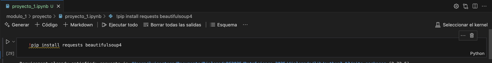
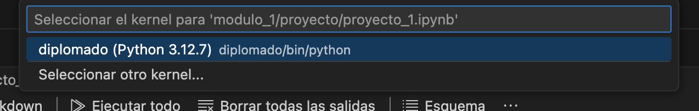

# Diplomado Ciencia de Datos

# Modulo 1

## Generación de ambiente virtual

Para ejecutar el proyecto se sugiere generar un entorno virtual de python con el archivo requirements.txt que se encuentra en esta misma carpeta

Generar el ambiente virtual

`python -m venv diplomado`

Activar ambiente

Mac
`source diplomado/bin/activate`

Windows
`diplomado\Scripts\activate`

## Instalación de librerías

Instalar librerias

`pip install -r requirements.txt`

## Selección de kernel
Abrir el archivo 

`modulo1/proyecto/proyecto_1.ipynb`

Seleccionar el kernel que se acaba de crear

Elegir el ambiente creado

## Ejecución

Ejecutar cada celda para obtener el resultado